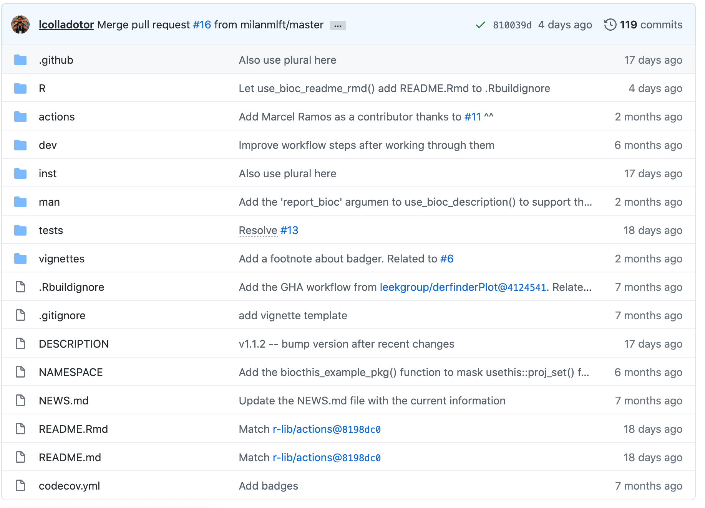

```{r setup, include = FALSE}

library(knitr)
library(tidyverse)

knitr::opts_chunk$set(echo = FALSE, message = FALSE)

```

> Aim: Give overview of principles behind and hands-on practice for developing Bioconductor-friendly packages using biocthis. 

# Outline

1. Why make R/Bioconductor packages?
2. What do R packages consist of?
3. Testing fundamentals. 
4. How to make Bioconductor-friendly packages using `biocthis`?
5. Package development workflow. 
6. Resources - what is not covered?
7. Hands on session - making your own `utils` package.

# Why make R/Bioconductor packages?

## R packages

- **Share** functions with others/yourself. 
- Improving the **organization** of your functions - e.g. mentality, documentation, continuous updates. 
- Integrated **unit testing** to keep your functions robust to future changes. 

Useful resources:

1. R packages [book](https://rstudio.com/products/rpackages/)
2. [Your first R package in 1 hour](https://www.pipinghotdata.com/posts/2020-10-25-your-first-r-package-in-1-hour/)

## Bioconductor packages

- **Share** code more widely with Bioconductor community. 
- Code review, learning about developing software - forced compliance with Bioconductor standards. 
- More citations - https://www.biorxiv.org/content/10.1101/2020.11.16.385211v1
- CV/reputation points. 

# What do R packages consist of?

## States of R packages 

- The structure of R packages is explained well [here](https://r-pkgs.org/package-structure-state.html).
- 5 states: 
    1. **source** - A set files/directories in a set structure. The state you develop with and encounter when cloning a repo.
    2. **bundles** - Source compressed into a single tar.gz (e.g. through `devtools::build()`)
    3. **binary** - Binary version (e.g. distributed by CRAN). Can be generated through `devtools::build(binary = TRUE)`. 
    4. **installed** - Either the binary or bundle that's decompressed and placed into your R package library (using `install.packages()`)
    5. **in-memory** - Load a package into memory using `library()` or `devtools::load_all()`. 

## Structure of R packages

R packages have several key components, which are shown in screen-shot taken from [here](https://github.com/lcolladotor/biocthis) and detailed below. 

```{r key-components, fig.cap = "biocthis package structure"}



```
1. **.github** - GitHub actions workflow.
2. **R** - Contains all the code for the functions of your package.
3. **inst** - Additional raw data you would like available to the user.
4. **man** - Function documentation generated by Roxygen. 
5. **tests** - Unit tests for functions. 
6. **vignettes** - Vignette description usage of your package
7. **DESCRIPTION** - Author details, licence, dependencies and general summary of your package. 
8. **README.md** - Documentation shown at the GitHub repository. 

# Testing fundamentals

3 levels of testing: 

1. **Unit testing** individual functions
2. **R CMD Check or BiocCheck** checks that you're package can be built, installed and complies to R/Bioconductor package guidelines. 
3. Testing across multiple **operating systems** using GHA
    
## Unit testing

- For complicated code, ensures future updates do not break existing functionality.  
- You do this already, just manually. 
- `testhat` automates this for R packages.
- Rule of thumb: If you catch a bug, write a test. 
- Metrics, try to be fast + comprehensive.

## R CMD Check or BiocCheck

- Reports `ERROR`/`WARNING`/`NOTE`s.
- `R CMD Check` that your package meets certain criteria: 
    - Runs all unit tests 
    - Have you set all the dependencies you need?
    - Have you documented your functions?
    - Have you written a proper `DESCRIPTION`?
    - Have you used `:::`?
    - Lots more... see [R packages page on R CMD Check](https://r-pkgs.org/r-cmd-check.html)
- `BiocCheck` is more stringent:
    - Are your functions less than 80 lines?
    - Do >80% have examples?

## Testing across Linux/Mac/Windows

- A great lecture on GHA basics from Jim Hester can be found [here](https://www.jimhester.com/talk/2020-rsc-github-actions/)
- GitHub actions is used in this case for testing, but is very flexible
- On an event, do something
- Written in yet-another-markdown-language (YAML)
- GitHub has "runners" based on Linux/Mac/Windows OS (and permits dockers)
- We run R CMD Check and BioCheck on all 3 to catch OS-specific issues

# How to make Bioconductor-friendly packages using `biocthis`?

`usethis` and `biocthis` are convienient helper packages for developing R/bioconductor packages respectively. 

## usethis

- [usethis](https://usethis.r-lib.org/) has a lot of functions to enable easy package development. 
    - `usethis::create_package()` - creates package skeleton
    - `usethis::use_r()` - creates .R function skeleton
    - `usethis::use_git()` - connects current package to git. 
    - `usethis::use_github()` - create a GitHub repo for current repo. 
    - `usethis::use_github_action()` - creates GHA skeleton

## biocthis

- Builds upon `usethis` specifically for Bioconductor packages: 
    - Templates for creating `DESCRIPTION`, `README.md` and vignettes
    - Styles using `BiocStyle`
    - Sets up a GitHub action workflow on all 3 OS (including using the Bioconductor docker for Linux) that includes `R CMD Check` and `BiocCheck`. 
    - Deploys a `pkgdown` page for your package. 
    - Sets up code coverage check.  
- Still under active development. 

# Package development workflow

A top-level workflow for modifying your package, then running tests and updating via `git` is shown below. 

```{r package-dev-workflow, out.height = 1000, fig.align = 'center'}
knitr::include_graphics("https://lucid.app/publicSegments/view/8fcef0de-1c16-477b-b471-beed1f01a57c/image.png")
```

# Resources - what hasn't been covered?

- What makes good tests/documentation? Where should I put raw vs processed vs internal data? What else does R CMD Check check? The [R packages](https://r-pkgs.org/r-cmd-check.html) book is highly recommended. 
- How to write your own GHA workflow? A good place to start with using GHA in R can be found [here](https://ropenscilabs.github.io/actions_sandbox/). 
- Submission/maintenance of Bioconductor packages. Info regarding submissions can be found [here](https://www.bioconductor.org/developers/package-submission/) and maintaining packages [here](https://www.bioconductor.org/developers/how-to/git/). 

# Reproducibility

```{r reproducibility, echo = FALSE}

# Session info
library("sessioninfo")

options(width = 120)

session_info()
```
